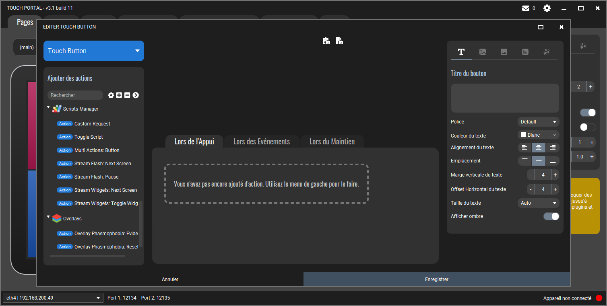

# TouchPortal Plugin

#### This plugin brings together my different tools.

It communicates with Scripts Manager to control the scripts present there, but can also send information to other connected clients.

Here are the different buttons available:
 - `Scripts Manager: Custom Request` => Send an object to Scripts Manager WebSocket
 - `Scripts Manager: Toggle Script` => Activate/Deactivate a script in Scripts Manager
 - `Multi Actions: Button` => Activates the \"Stream Deck - Action\" block in Multi Actions of Scripts Manager
 - `Stream Flash: Next Screen` => Changes the screen on which to display the script
 - `Stream Flash: Pause` => Enable/Disable flash pause
 - `Stream Widgets: Next Screen` => Changes the screen on which to display the script
 - `Stream Widgets: Toggle Widget` => Activate/Deactivate a widget in Stream Widgets of Scripts Manager
 - `Overlay Phasmophobia: Evidence` => Interacts with the overlay for Phasmophobia
 - `Overlay Phasmophobia: Reset` => Disables all evidence on the overlay for Phasmophobia
